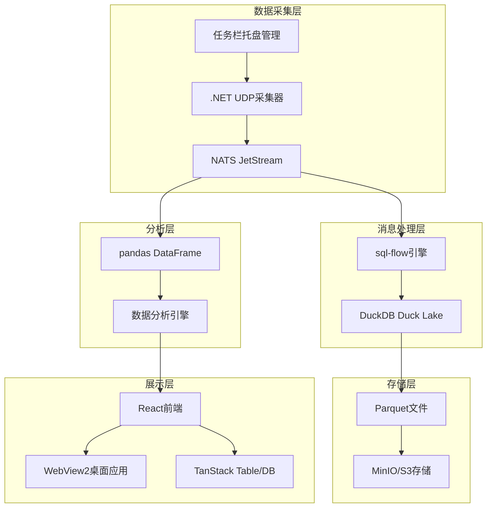

# LT-PDCS-NATS-POC

**Langtian NATS Event-Driven Architecture Platform**

[](LICENSE)
[](https://github.com/fbsqual/LT-pdcs-nats-poc/issues)
[](https://github.com/fbsqual/LT-pdcs-nats-poc/stargazers)
[](https://github.com/TencentCloudBase/CloudBase-AI-ToolKit)

> 基于NATS JetStream的高性能事件驱动数据处理平台，实现从UDP数据采集到实时数据分析的完整解决方案。

## 🚀 项目概述

LT-PDCS-NATS-POC是一个现代化的事件驱动架构(EDA)平台，专为高性能数据处理和实时分析而设计。项目整合了NATS JetStream、sql-flow、DuckDB Duck Lake等前沿技术，提供端到端的数据处理解决方案。

### 核心特性

- 🔥 **高性能消息处理**: 基于NATS JetStream，支持>10,000 msg/sec吞吐量
- 📊 **实时数据分析**: 集成pandas DataFrame，支持复杂数据分析
- 🏗️ **现代化架构**: 采用Duck Lake lakehouse格式，简化数据管理
- 💻 **原生桌面体验**: WebView2 + React，提供流畅的Windows应用体验
- 🔧 **灵活扩展**: 模块化设计，支持自定义数据源和处理逻辑

## 🏗️ 系统架构



## 🛠️ 技术栈

### 后端技术

- **消息总线**: NATS JetStream 2.10+
- **流处理**: sql-flow (自定义NATS Source)
- **数据存储**: DuckDB 1.3+ with Duck Lake extension
- **对象存储**: MinIO/S3
- **数据采集**: .NET 8 UDP采集器

### 前端技术

- **桌面框架**: WebView2 + ASP.NET Core
- **前端框架**: React 18 + TypeScript
- **数据处理**: TanStack Table + TanStack DB
- **数据分析**: pandas DataFrame (通过NATS通信)

### 开发工具

- **容器化**: Docker + Docker Compose
- **CI/CD**: GitHub Actions
- **代码质量**: SonarQube + ESLint
- **监控**: Prometheus + Grafana

## 📦 快速开始

### 环境要求

- Node.js 18+
- .NET 8 SDK
- Go 1.21+ (用于sql-flow扩展开发)
- Docker & Docker Compose
- Git

### 安装步骤

1. **克隆仓库**

```bash
git clone https://github.com/fbsqual/LT-pdcs-nats-poc.git
cd LT-pdcs-nats-poc
```

2. **启动基础服务**

```bash
# 启动NATS、MinIO等基础服务
docker-compose up -d

# 验证服务状态
docker-compose ps
```

3. **构建和运行**

```bash
# 安装前端依赖
cd frontend
npm install

# 构建前端应用
npm run build

# 启动后端服务
cd ../backend
dotnet restore
dotnet run
```

4. **访问应用**

- 桌面应用: 运行生成的.exe文件
- Web界面: http://localhost:5001
- NATS监控: http://localhost:8222

## 📋 开发计划

项目采用三阶段开发模式：

### 🎯 阶段一：PoC验证 (2-3周)

- [x] 技术预研和架构设计
- [ ] NATS JetStream基础部署
- [ ] sql-flow NATS Source实现
- [ ] DuckDB Duck Lake集成
- [ ] 基础前端界面

### ⚡ 阶段二：核心功能 (3-4周)

- [ ] protobuf schema管理
- [ ] TanStack DB响应式存储
- [ ] 系统监控和管理
- [ ] Windows Service部署

### 🏆 阶段三：生产就绪 (2-3周)

- [ ] 高可用集群部署
- [ ] 性能优化调优
- [ ] 安全合规实现
- [ ] 完整部署文档

详细计划请查看 [TASK_PLAN.md](TASK_PLAN.md)

## 📚 文档

- [项目规格说明书](PROJECT_SPEC.md) - 完整的技术规格和架构设计
- [开发日志](DEVELOPMENT_LOG.md) - 详细的开发进展记录
- [任务计划](TASK_PLAN.md) - 分阶段开发计划和任务分解
- [API文档](docs/api/) - 接口文档和使用说明
- [部署指南](docs/deployment/) - 生产环境部署指南

## 🤝 贡献指南

我们欢迎所有形式的贡献！请查看 [CONTRIBUTING.md](CONTRIBUTING.md) 了解详细信息。

### 开发流程

1. Fork 项目
2. 创建功能分支 (`git checkout -b feature/AmazingFeature`)
3. 提交更改 (`git commit -m 'Add some AmazingFeature'`)
4. 推送到分支 (`git push origin feature/AmazingFeature`)
5. 创建 Pull Request

### 代码规范

- 使用 [Conventional Commits](https://conventionalcommits.org/) 提交格式
- 所有PR必须通过代码审查
- 单元测试覆盖率 >80%
- 遵循项目的ESLint和Prettier配置

## 📊 性能指标

| 指标 | 目标值 | 当前状态 |
|------|--------|----------|
| 消息吞吐量 | >10,000 msg/sec | 🔄 开发中 |
| 端到端延迟 | <100ms (P95) | 🔄 开发中 |
| 数据可靠性 | 99.9%不丢失 | 🔄 开发中 |
| 系统可用性 | 99.5%运行时间 | 🔄 开发中 |

## 🐛 问题反馈

如果您发现任何问题或有改进建议，请：

1. 查看 [已知问题](https://github.com/fbsqual/LT-pdcs-nats-poc/issues)
2. 创建新的 [Issue](https://github.com/fbsqual/LT-pdcs-nats-poc/issues/new)
3. 提供详细的问题描述和复现步骤

## 📄 许可证

本项目采用 MIT 许可证 - 查看 [LICENSE](LICENSE) 文件了解详情。

## 🙏 致谢

感谢以下开源项目的支持：

- [NATS](https://nats.io/) - 高性能消息系统
- [sql-flow](https://github.com/turbolytics/sql-flow) - SQL流处理引擎
- [DuckDB](https://duckdb.org/) - 高性能分析数据库
- [TanStack](https://tanstack.com/) - 现代化React工具链
- [WebView2](https://developer.microsoft.com/en-us/microsoft-edge/webview2/) - 现代Web视图

---

**项目状态**: 🔄 开发中
**最后更新**: 2025-08-26
**维护者**: [@fbsqual](https://github.com/fbsqual)